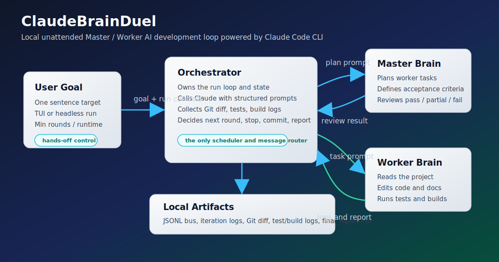
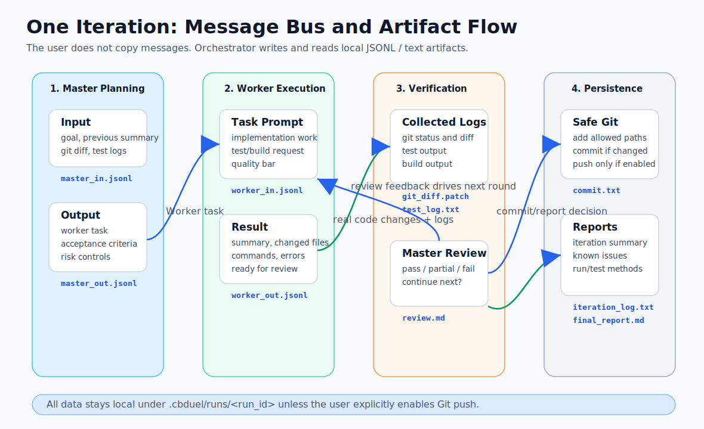

# ClaudeBrainDuel

ClaudeBrainDuel 是一个基于 Claude Code CLI 的本地 AI 自动开发主控工具。用户只需要输入目标，系统会自动调度 Master 主脑和 Worker 副脑持续协作，完成规划、编码、测试、构建、验收、修复、Git 提交和最终报告。它的核心价值是让用户放手离开，在长时间不操作的情况下，也能让 AI 按轮次推进项目并尽量交付可运行成果。



## 适合什么场景

| 场景 | ClaudeBrainDuel 做什么 |
| --- | --- |
| 从零生成一个项目 | Master 拆目标，Worker 读写文件、构建实现、补 README/测试/日志 |
| 长时间无人值守开发 | 设置最低轮数和最短运行时间，让 AI 不因一次 pass 就提前停 |
| 自动修复当前项目 | 每轮收集 Git diff、测试日志、构建日志，再让 Master 验收 |
| 希望看到 AI 在做什么 | TUI 可切换 Master、Worker、events、git、tests、report 视图 |
| 不想手动复制粘贴 | Master/Worker 通过本地 JSONL 消息总线交换信息 |

## 核心特性

- 一个主控终端窗口：运行 `cbduel` 后在同一窗口里输入目标、切换视图、暂停或停止。
- 左右脑自动协作：Master 负责规划、拆解、验收；Worker 负责读项目、改代码、跑命令。
- 本地消息总线：所有中间消息写入 `.cbduel/runs/<run_id>/bus/`，用户不用传话。
- 长时间无人值守：支持 `--min-rounds`、`--min-runtime-min`、`--landing soft|hard`、`--refresh-interval-sec`。
- 过程可追溯：每轮保存 prompt、输出、diff、测试日志、构建日志、review、commit、`iteration_log.txt`。
- Git 安全自动化：可自动建分支、自动提交，默认不 push，不执行危险 Git/文件命令。
- 降级不崩溃：Claude 缺失、鉴权失败、超时、JSON 解析失败、Git/测试/构建失败都会记录事件。

## 工作流图



## 安装

要求：

| 依赖 | 版本/说明 |
| --- | --- |
| Node.js | 20 或更高 |
| npm | 随 Node 安装 |
| Git | 用于分支、diff、commit |
| Claude Code CLI | 本机可执行 `claude`，并完成登录/工作区信任 |

本地安装：

```bash
git clone <your-repo-url>
cd claude-brain-duel
npm install
npm run build
npm link
```

Windows PowerShell 如果遇到执行策略限制，可用：

```powershell
npm.cmd install
npm.cmd run build
npm.cmd link
```

PowerShell 直接运行 `cbduel` 如被 `.ps1` 签名策略拦住，可改用：

```powershell
cbduel.cmd
```

## 快速开始

进入你要让 AI 开发的项目目录：

```cmd
cd /d "C:\path\to\your-project"
cbduel init
cbduel
```

启动后可以直接输入一句目标：

```text
你现在从零开始制作一个“想象力不设限”的贪吃蛇游戏。不要只做普通版本，要尽最大可能发挥想象力：从玩法、视觉、音效、关卡、成长系统、AI敌人、地图机制、剧情、技能、道具、多人模式、物理效果、隐藏彩蛋等角度持续扩展。先实现一个可运行版本，再不断迭代成更有创意、更完整、更惊艳的作品。每次完成一轮开发后，必须输出：1）本轮实现了什么；2）还能如何继续发挥想象力；3）下一轮具体要做什么。无论当前版本多完善，都不允许停止思考下一步创意。
```

也可以直接用完整命令启动：

```cmd
cbduel.cmd run "你现在从零开始制作一个“想象力不设限”的贪吃蛇游戏。不要只做普通版本，要尽最大可能发挥想象力：从玩法、视觉、音效、关卡、成长系统、AI敌人、地图机制、剧情、技能、道具、多人模式、物理效果、隐藏彩蛋等角度持续扩展。先实现一个可运行版本，再不断迭代成更有创意、更完整、更惊艳的作品。每次完成一轮开发后，必须输出：1）本轮实现了什么；2）还能如何继续发挥想象力；3）下一轮具体要做什么。无论当前版本多完善，都不允许停止思考下一步创意。" --mode tui --rounds 8 --min-rounds 3 --time-limit-min 120 --min-runtime-min 30 --landing soft --refresh-interval-sec 5 --auto-commit true --branch true
```

## 常用命令

| 命令 | 作用 |
| --- | --- |
| `cbduel init` | 初始化配置、日志目录、模板、README，并检查 `claude` 和 Git |
| `cbduel` | 进入默认 TUI 主控窗口 |
| `cbduel run "目标"` | 使用命令行目标启动 |
| `cbduel run "目标" --mode headless` | 无界面后台运行，适合脚本/CI |
| `cbduel run "目标" --mode manual` | 不调用 Claude，仅生成提示词文件作为降级方案 |

## TUI 用法

| TUI 命令 | 说明 |
| --- | --- |
| `/goal <目标>` | 设置目标 |
| `/start` | 开始运行 |
| `/pause` | 暂停调度 |
| `/resume` | 继续 |
| `/stop soft` | 软着陆：当前轮完成后停止 |
| `/stop hard` | 硬着陆：中断当前 Claude 调用并尽快退出 |
| `/master` 或 `/m` | 查看 Master 主脑规划/验收 |
| `/worker` 或 `/w` | 查看 Worker 副脑执行过程 |
| `/events` 或 `/e` | 查看事件时间线 |
| `/git` 或 `/g` | 查看 Git 状态和 diff |
| `/tests` 或 `/t` | 查看测试/构建日志 |
| `/report` 或 `/r` | 查看最终报告 |
| `/params` | 重新显示中文参数说明 |
| `/exit` | 退出主控窗口 |

注意：新版 TUI 支持直接粘贴完整 `cbduel.cmd run "..." --rounds ...` 命令，会自动解析参数；旧版会把整条命令当成目标文本。

## 长时间无人值守参数

| 参数 | 默认值 | 说明 |
| --- | --- | --- |
| `--rounds <n>` | `5` | 最多运行多少轮，当前校验上限 50 |
| `--min-rounds <n>` | `1` | 最少完成多少轮，Master 提前 pass 也不会提前停 |
| `--time-limit-min <n>` | `60` | 最长运行时间，到时间后不再开启新一轮 |
| `--min-runtime-min <n>` | `0` | 最短运行时间，没到时间不会写最终报告 |
| `--landing soft` | `soft` | 停止时做完当前轮再退出 |
| `--landing hard` | `soft` | 停止时直接中断当前 Claude 调用 |
| `--refresh-interval-sec <n>` | `2` | TUI 刷新间隔，避免频繁刷屏 |
| `--auto-commit <true|false>` | `true` | 每轮有实质改动时自动 commit |
| `--push <true|false>` | `false` | 是否自动 push，默认关闭 |
| `--branch <true|false>` | `true` | 是否自动创建 `cbduel/<goal>-<time>` 分支 |

示例：最少跑 7 小时，尽量跑满 50 轮：

```cmd
cbduel.cmd run "你现在从零开始制作一个“想象力不设限”的贪吃蛇游戏。不要只做普通版本，要尽最大可能发挥想象力：从玩法、视觉、音效、关卡、成长系统、AI敌人、地图机制、剧情、技能、道具、多人模式、物理效果、隐藏彩蛋等角度持续扩展。先实现一个可运行版本，再不断迭代成更有创意、更完整、更惊艳的作品。每次完成一轮开发后，必须输出：1）本轮实现了什么；2）还能如何继续发挥想象力；3）下一轮具体要做什么。无论当前版本多完善，都不允许停止思考下一步创意。" --mode tui --rounds 50 --min-rounds 50 --time-limit-min 480 --min-runtime-min 420 --landing soft --refresh-interval-sec 5 --auto-commit true --branch true
```

## 左右脑如何交换信息

ClaudeBrainDuel 的 Orchestrator 是唯一调度中心。Master 和 Worker 不直接互相调用，而是通过本地 JSONL 总线交换结构化信息。

| 文件 | 写入者 | 读取/使用者 | 内容 |
| --- | --- | --- | --- |
| `master_in.jsonl` | Orchestrator | Master 调用前记录 | 总目标、上一轮摘要、Git diff、测试/构建日志 |
| `master_out.jsonl` | Orchestrator | Orchestrator/TUI | Master 的计划、Worker 任务、验收标准、review |
| `worker_in.jsonl` | Orchestrator | Worker 调用前记录 | Worker 具体任务、验收标准、质量要求 |
| `worker_out.jsonl` | Orchestrator | Master review/TUI | Worker 输出、执行摘要、错误、文件变化 |
| `events.jsonl` | Orchestrator | TUI/最终报告 | 运行事件、错误、Claude 进度、Git/测试/构建状态 |
| `state.json` | Orchestrator | TUI | 当前轮次、状态、分支、日志路径、测试状态 |

每一轮处理顺序：

1. Orchestrator 收集上一轮结果、Git status、Git diff、测试/构建日志。
2. Master 根据总目标生成 Worker 任务和验收标准。
3. Worker 调用 Claude Code 读写项目、运行测试/构建、输出结构化结果。
4. Orchestrator 再次收集 Git diff、测试日志、构建日志。
5. Master 审核 Worker 输出和实际 diff，给出 `pass`、`partial` 或 `fail`。
6. 有实质改动且 `autoCommit=true` 时自动 `git add` 和 `git commit`。
7. 本轮所有 artifact 和 `iteration_log.txt` 落盘。
8. 达到目标、轮数、时间或停止条件后生成 `final_report.md`。

## 目录和日志

运行时目录：

```text
.cbduel/runs/<run_id>/
  bus/
    master_in.jsonl
    master_out.jsonl
    worker_in.jsonl
    worker_out.jsonl
    events.jsonl
    state.json
  iterations/
    001/
      master_prompt.md
      master_output.md
      worker_prompt.md
      worker_output.md
      git_status.txt
      git_diff.patch
      test_log.txt
      build_log.txt
      review.md
      commit.txt
      iteration_log.txt
  final_report.md
```

`iteration_log.txt` 是每轮结束后的纯文本摘要，包含本轮做了什么、测试/构建结果、commit 输出、错误和所有 artifact 路径。`final_report.md` 是最终报告，包含目标、完成内容、每轮摘要、文件变化、commit 列表、运行方法、测试方法、已知问题和后续建议。

## Git 自动化和安全边界

默认行为：

| 项 | 行为 |
| --- | --- |
| 分支 | 自动创建 `cbduel/<goal-slug>-<timestamp>` |
| 提交 | 每轮有实质改动时提交 `cbduel(iteration N): <summary>` |
| Push | 默认关闭，需要显式 `--push true` |
| 敏感文件 | 排除 `.env`、token、secret、key、pem 等常见敏感路径 |
| 危险命令 | 禁止 `git reset --hard`、`git clean -fd`、`rm -rf`、force push |

## 配置文件

`cbduel init` 会创建 `cbduel.config.json`。常用字段：

```json
{
  "defaultRounds": 5,
  "defaultMinRounds": 1,
  "defaultTimeLimitMin": 60,
  "defaultMinRuntimeMin": 0,
  "mode": "tui",
  "landing": "soft",
  "refreshIntervalSec": 2,
  "autoCommit": true,
  "push": false,
  "createBranch": true,
  "testCommand": "",
  "buildCommand": "",
  "finalRequirements": "必须可运行，不是 MVP；必须有日志、README、错误处理、最终报告；能测试就测试。",
  "claude": {
    "command": "claude",
    "outputFormat": "json",
    "allowedTools": ["Read", "Write", "Edit", "MultiEdit", "Glob", "Grep", "LS"],
    "maxRetries": 1,
    "timeoutMs": 900000,
    "permissionMode": "auto"
  },
  "qualityBar": "生产可用：直接改代码、能运行、能测试、有 README、有日志、有错误处理、有最终报告。"
}
```

命令行参数会覆盖配置文件，仅对本次运行生效。

## 开发和测试

```bash
npm install
npm run build
npm test
```

测试覆盖：

- CLI 参数解析
- TUI 粘贴完整 `cbduel run ...` 命令解析
- 配置校验
- MessageBus 文件和 state 写入

## 常见问题

| 问题 | 处理 |
| --- | --- |
| `cbduel` 不是内部或外部命令 | 运行 `npm link`，并确认 npm 全局 bin 在 PATH 中 |
| PowerShell 阻止 `cbduel.ps1` | 用 `cbduel.cmd` |
| Claude 第一次运行卡在 trust workspace | 先在目标目录手动运行一次 `claude`，确认信任目录和登录 |
| TUI 里参数没生效 | 确认看到 `round: 1/50 | min=50` 等状态；旧运行不会热更新，需要先 `/stop soft` 再重启 |
| 输出 JSON 解析失败 | 会写入 `events.jsonl` 并尽量降级继续 |
| Git commit 失败 | 会记录到事件和 `commit.txt`，不会中断整个运行 |

## License

ClaudeBrainDuel is released under the GNU General Public License v3.0 or later (`GPL-3.0-or-later`).

这意味着你可以运行、研究、修改和分发本项目；如果你分发修改版或衍生作品，也需要按照 GPL-3.0-or-later 的要求提供相同许可证下的源代码和许可证文本。完整条款见 [LICENSE](LICENSE)。
